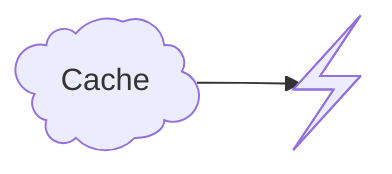
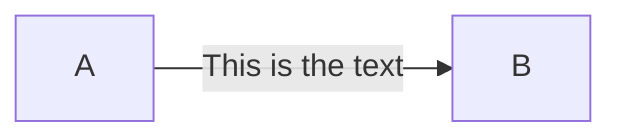
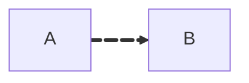
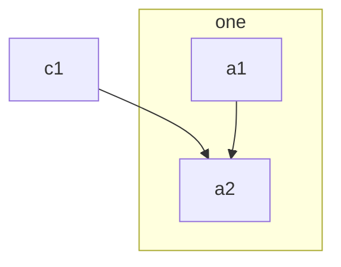

# Mermaid flowchart notes

Source checked: Mermaid flowchart docs, 2026-07-22. Use these options when they make a small flowchart clearer, not decorative.

## Expanded node shapes

Mermaid v11.3.0+ supports expanded flowchart node shapes with this syntax:



Use these when the shape adds meaning; otherwise prefer simple nodes. Keep labels short and readable.

- process: `rect`, `rounded`, `stadium`, `fr-rect`, `st-rect`, `div-rect`, `lin-rect`
- decisions and conditions: `diam`, `hex`, `notch-pent`
- starts, stops, and joins: `circle`, `sm-circ`, `dbl-circ`, `fr-circ`, `f-circ`, `fork`
- data and storage: `cyl`, `datastore`, `h-cyl`, `lin-cyl`, `bow-rect`, `win-pane`
- input, output, and display: `lean-r`, `lean-l`, `sl-rect`, `curv-trap`
- documents and files: `doc`, `docs`, `lin-doc`, `tag-doc`, `flip-tri`, `flag`
- manual or priority work: `trap-t`, `trap-b`
- communication and comments: `cloud`, `bolt`, `brace`, `brace-r`, `braces`, `comment`, `card`
- special: `bang`, `hourglass`, `tri`, `cross-circ`, `tag-rect`, `text`, `odd`

Useful aliases include `database` for `cyl`, `decision` for `diam`, `document` for `doc`, `subprocess` for `fr-rect`, `terminal` for `stadium`, `start` for `sm-circ`, and `stop` for `fr-circ`.

Icon and image nodes are also available in v11.3.0+. Use them sparingly, and only when the renderer will have the icon pack or a stable public image URL:

```mermaid
flowchart TD
  A@{ img: "https://example.com/image.png", label: "Image", pos: "t", h: 60, constraint: "on" }
```

## Links and labels

Put text on an edge when the relationship needs a verb, condition, or outcome label:



Other useful edge forms: open `---`, arrow `-->`, thick `==>`, dotted `-.->`, circle `--o`, cross `--x`, and bidirectional `<-->`.

## Edge IDs and animation

Edge IDs let you style or animate important edges. Mermaid supports `fast` and `slow`; prefer `slow` for emphasis and use animation on at most one or two edges:



## Subgraphs

Use subgraphs to group a few related steps. They can have an explicit id and label, and flowcharts can connect into or out of a subgraph:



Subgraphs can set their own `direction`, but Mermaid ignores that local direction when subgraph nodes are linked to outside nodes.
