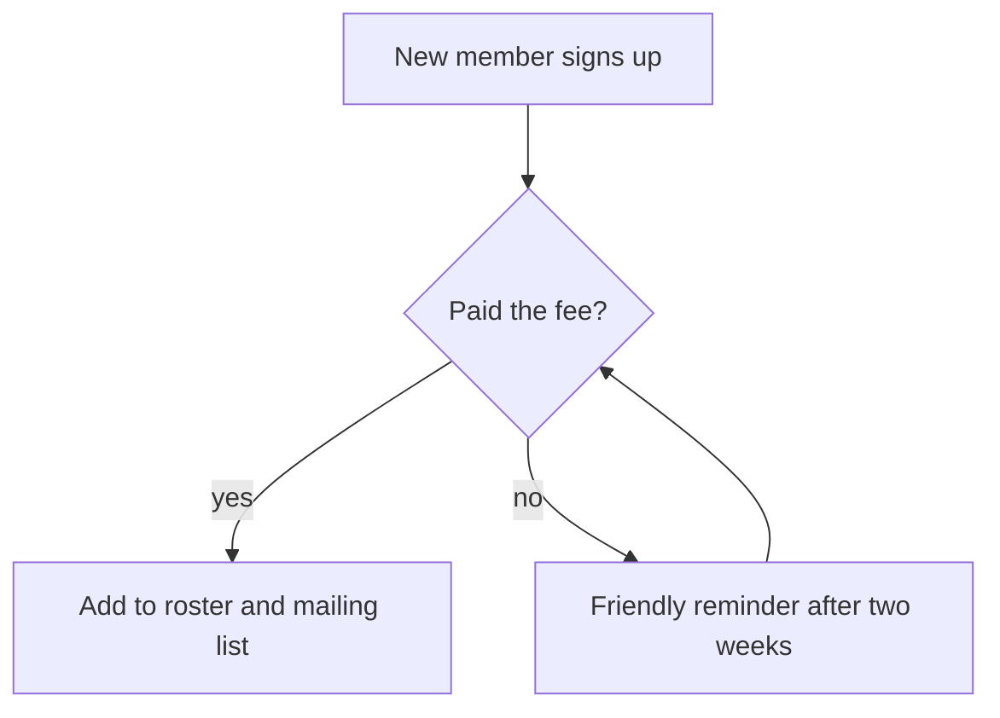

Imagine hiring a brilliant assistant who starts tomorrow. You have two options: spend your budget on an even more brilliant assistant, or spend an afternoon writing a short handbook about how your club, shop, or household actually works. The handbook wins every time. The same is true for models: [Choosing a model](/learning/choosing-a-model) matters far less than what the model gets to see. Managing context well gets you roughly 80% of the way, and it costs nothing but a bit of writing.

## Why context is the bottleneck

A model only knows two things: what it learned during training (the whole internet, none of your specifics) and what is in front of it right now, the context. It has never heard of your volunteer roster, your definition of "active member," or the fact that invoices from one particular supplier always arrive twice. Every time an answer feels generic or subtly wrong, the cause is usually not a dumb model, it is a briefing that never happened.

The good news: unlike model quality, context is entirely under your control.

## Your knowledge, in plain markdown files

The simplest and most durable way to brief a model is a folder of markdown files: plain text with headings, the format models read and write most fluently. No database, no special tool, just files:

```
my-project/
  README.md            <- what this project is, and a map of the rest
  people.md            <- who is who, roles, who decides what
  definitions.md       <- what words mean here ("active member" = paid this year)
  decisions.md         <- choices made and why, so they stay made
  processes/
    onboarding.md      <- how a new member joins, step by step
    yearly-tour.md     <- how the June tour gets planned
```

What goes in them? The things you would tell a new volunteer in their first week: the words you use and what they mean, the exceptions ("the Jansen family pays per household, not per person"), a few examples of what good output looks like, and decisions with their reasons. One topic per file, descriptive filenames, each file short enough to read in a minute. Writing it once beats explaining it in every conversation.

## Let the model load it progressively

Here is the trick that makes the folder structure more than tidiness: you do not paste everything into the chat. The context window is finite and every token costs money and attention ([Tokens, embeddings, and latent space](/learning/tokens-embeddings-latent-space) explains why). Instead, the `README.md` acts as a table of contents, and a model with a file-reading tool navigates: it reads the map, decides it needs `processes/yearly-tour.md` for this question, and loads just that.

This is called progressive loading, and it mirrors how you would treat a human colleague. You do not read the entire binder aloud at every meeting; you hand them the binder with a good index and trust them to open the right tab. Descriptive filenames and a clear folder structure *are* the index. This is also exactly how modern coding agents work: they keep a small map file in the project and read deeper only when a task demands it.

## Draw the picture, in text

Some knowledge resists prose: flows, decision points, who-reports-to-whom. For those, [Mermaid](https://mermaid.js.org/) is worth knowing about. It is a way to describe diagrams as plain text, which means models can read them, reason about them, and update them just like any other file. This is all you write:

```text
graph TD
  A[New member signs up] --> B{Paid the fee?}
  B -- yes --> C[Add to roster and mailing list]
  B -- no --> D[Friendly reminder after two weeks]
  D --> B
```

And this is how tools that understand Mermaid (GitHub, Notion, this very page) show it:



Five lines of text, and both you and the model now share an unambiguous picture of the onboarding flow. The same file serves humans and models at once, and when the process changes, you edit a line of text instead of redrawing boxes.

## Try it right here

The Gardener practices what this page preaches: it keeps an index of all learning articles in its briefing and reads a full article only when your question calls for it. For your own project, start embarrassingly small: one `README.md` with five bullet points about your situation, pasted into the conversation or added to your project. Watch how much less generic the answers get. Then, the next time you catch yourself explaining the same thing twice, that is your cue: it belongs in a file.

## Where to go next

Once your knowledge lives in files, a model needs hands to reach them: [What is an agent?](/learning/what-is-an-agent) explains the tool loop that does the reading. And if you are still tempted to solve a quality problem with a pricier model, reread [Choosing a model](/learning/choosing-a-model) first: upgrade the briefing before the intern.
